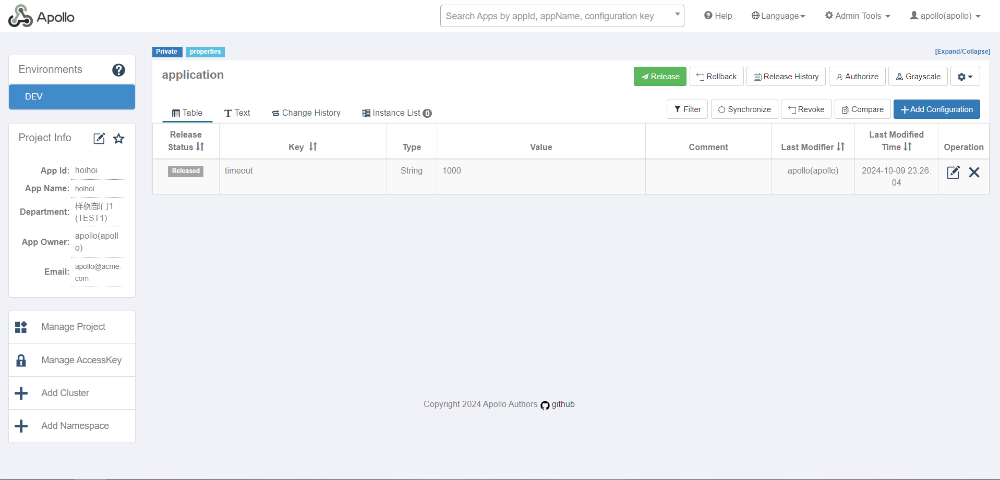
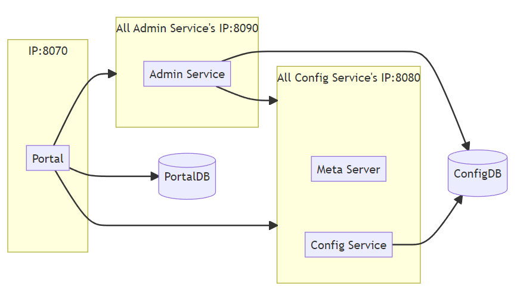
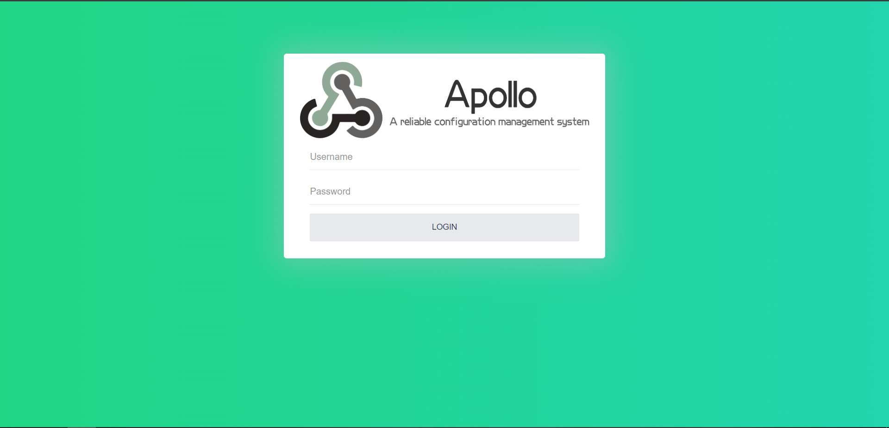

# Verander je configuraties van je microservices makkelijk met apollo


*[Jarno van Fessem, oktober 2024.](https://github.com/hanaim-devops/devops-blog-JarnoVanFessem)*
<hr/>

## Inhoudsopgave

- [Wat is Apollo?](#wat-is-apollo)
  - [Applicatie structuur Apollo](#applicatie-structuur-apollo)
- [Wat zijn de voordelen van Apollo?](#wat-zijn-de-voordelen-van-apollo)
- [Wat zijn de nadelen van Apollo?](#wat-zijn-de-nadelen-van-apollo)
- [Stapsgewijze Implementatie van Apollo](#stapsgewijze-implementatie-van-apollo)
  - [Quick start met Docker](#quick-start-met-docker)
    - [Development guide in Kubernetes](#development-guide-in-kubernetes)
      - [MySQL database klaarzetten](#mysql-database-klaarzetten)
        - [Create Apollo Databases](#create-apollo-databases)
        - [Import the SQL Scripts](#import-the-sql-scripts)
    - [Apollo services installeren](#apollo-services-installeren)
      - [Configuraties gebruiken](#configuraties-gebruiken)
- [Conclusie](#conclusie)

In de wereld van microservices is een goed configuratiebeheer cruciaal voor het soepel draaien van applicaties. Apollo is een krachtig tool voor configuratiemanagement dat speciaal is ontworpen voor het beheren van configuraties in een microservices-architectuur. In deze blog wordt er gekeken naar hoe Apollo gebruikt kan worden in een microservices applicatie?

Eerst wordt er uitgelegd wat Apollo is en wat de voordelen en nadelen hiervan zijn. Hierna volgt een hands-on onderdeel met opzet van de Apollo applicatie in een kubernetes cluster gedeployed naar localhost.

## Wat is Apollo?

Apollo is een open-source configuration management platform dat is ontwikkeld door Ctrip, een van de grootste online reisplatformen in China, en later vrijgegeven als een project op GitHub. Het primaire doel van Apollo is om het centrale beheer van configuraties mogelijk te maken voor gedistribueerde applicaties, waaronder microservices. Het biedt een eenvoudige manier om configuraties dynamisch en real-time te beheren zonder dat de applicaties opnieuw opgestart hoeven te worden. Hierdoor worden de operationele processen vereenvoudigd, vooral in complexe omgevingen waar meerdere microservices actief zijn. Het aanpassen van deze configuraties gebeurt in de portaal applicatie.(Apollo, z.d.-a),(Apollo, z.d.-b),(Microservices, z.d.)


*Afbeelding 1 - Apollo portaal overzicht*

### Applicatie structuur Apollo

De applicatiestructuur van Apollo Configuration Management bestaat uit verschillende componenten die samenwerken om centrale configuratiebeheer mogelijk te maken voor microservices. Hier is een korte uitleg van de belangrijkste onderdelen:

1. Portal
De Portal is de web-based gebruikersinterface van Apollo, waarmee gebruikers configuraties kunnen beheren, aanpassen en monitoren.

2. PortalDB
De PortalDB is de database die door de Portal wordt gebruikt om metadata op te slaan, zoals gebruikersinformatie, configuratiegeschiedenis, en instellingen. Het bevat geen daadwerkelijke configuraties (deze zitten in de ConfigDB), maar houdt alle informatie bij die nodig is om de Portal goed te laten functioneren.

3. AdminService
De AdminService is de backend service die verantwoordelijk is voor het beheren van configuratiegegevens en de communicatie tussen de Portal en andere Apollo-services. Het handelt de administratieve taken af, zoals het opslaan van configuratiewijzigingen en het controleren van toegangsrechten via Role-Based Access Control (RBAC).

4. ConfigService
De ConfigService is de kerncomponent van Apollo die verantwoordelijk is voor het leveren van configuraties aan de microservices. Deze service luistert naar configuratiewijzigingen en zorgt ervoor dat de microservices real-time toegang krijgen tot de nieuwste configuraties. Het werkt nauw samen met de ConfigDB om configuratiegegevens op te halen en te distribueren.

5. ConfigDB
De ConfigDB is de database waarin alle configuratiegegevens worden opgeslagen. Het bevat de daadwerkelijke configuraties voor de microservices in verschillende omgevingen (zoals ontwikkeling, test, productie). ConfigService haalt hier de configuratiegegevens op om deze aan de microservices door te geven.


*Afbeelding 2 - Apollo applicatiestructuur*

(Apollo, z.d.-a),(Two Sides Of Ctrip: How Does The Distributed Configuration Center Server Perceive Configuration Changes?, 2022)

## Wat zijn de voordelen van Apollo?

Apollo biedt aanzienlijke voordelen bij het beheren van configuraties in een microservices-architectuur. Het stelt teams in staat om configuraties centraal te beheren, waardoor beheer eenvoudiger wordt, en biedt real-time wijzigingen zonder downtime, wat operationele efficiëntie verbetert. Bovendien is Apollo schaalbaar, biedt versiebeheer en rollback-functionaliteit, en integreert naadloos met frameworks zoals Spring Cloud en Kubernetes. Dit maakt het ideaal voor grote organisaties met complexe omgevingen.

| **Voordeel**                                  | **Uitleg**                                                                                   |
|-----------------------------------------------|-----------------------------------------------------------------------------------------------|
| Centraal configuratiebeheer                   | Beheer alle configuraties voor verschillende services en omgevingen vanuit één centrale plek.   |
| Real-time configuratiewijzigingen zonder herstart | Voer wijzigingen direct door zonder downtime of het herstarten van services.                   |
| Schaalbaar en flexibel                        | Ondersteunt duizenden microservices en verschillende omgevingen, zoals ontwikkeling en productie.|
| Versiebeheer en rollback-functionaliteit      | Logt alle wijzigingen en maakt eenvoudig terugschakelen naar een vorige configuratie mogelijk.  |
| Integratie met populaire frameworks           | Werkt goed met Spring Cloud en Kubernetes voor eenvoudig centraal configuratiebeheer.          |
| Veiligheid via Role-Based Access Control (RBAC) | Beperk configuratiewijzigingen tot bevoegde gebruikers om fouten te voorkomen.                 |
| Ondersteuning voor meerdere datatypes         | Ondersteunt JSON, XML, YAML en andere formats voor maximale flexibiliteit.                     |
| Notificaties en monitoring                    | Stuur meldingen bij wijzigingen en integreer met tools als Prometheus of Grafana voor monitoring.|
| Verbeterde DevOps-workflow                    | Automatisering van configuratiebeheer in CI/CD-pipelines voor consistente deployments.          |
| Lagere kans op menselijke fouten              | Web-based UI en rollback-mogelijkheden beperken de impact van fouten.                          |

(YesChat.AI, z.d.),(Apollo, z.d.-a),(Microservices, z.d.),(探索CTRIp Apollo Client:一款强大的配置中心客户端-CSDN博客, z.d.)

## Wat zijn de nadelen van Apollo?

Hoewel Apollo veel voordelen biedt voor configuratiebeheer in microservices, zijn er ook enkele nadelen waar rekening mee moet worden gehouden. De implementatie kan complex en tijdrovend zijn, vooral in bestaande architecturen, en er is een zekere afhankelijkheid van Apollo als centrale service. Bovendien kan prestatie-overhead optreden door real-time updates. Teams moeten ook rekening houden met beveiligingsuitdagingen en de steile leercurve bij het implementeren van Apollo. Er is ook amper documentatie/blogpost te vinden over Apollo en als je ze vind is het vooral in het chiness. Daarom zijn de nadelen die hier beschreven zijn vooral uit eigen ervaring

| **Nadeel**                                    | **Uitleg**                                                                                     |
|-----------------------------------------------|-----------------------------------------------------------------------------------------------|
| Complexiteit bij implementatie en onderhoud    | Vereist uitgebreide setup en onderhoud, vooral in bestaande systemen zonder ervaring.           |
| Afhankelijkheid van een centrale service      | Apollo vormt een single point of failure als het niet goed is geconfigureerd of onderhouden.    |
| Prestatie-overhead                            | Real-time updates kunnen extra netwerkverkeer en latency veroorzaken in gedistribueerde systemen.|
| Beperkte documentatie en ondersteuning         | Documentatie kan ontoereikend zijn, vooral voor complexe configuraties of niet-standaard situaties. En als je documentatie vind is het vaak in het chinees|
| Beveiligingsuitdagingen                       | Extra aandacht vereist voor het beveiligen van toegang tot gevoelige configuraties.             |
| Learning curve                                | Apollo heeft een steile leercurve, vooral voor teams zonder ervaring met centrale configuratietools. Ook komen er veel nieuwe technologiën aan bod die niet worden uitgelegd |

## Stapsgewijze Implementatie van Apollo

Nu ga ik je uitleggen hoe je zelf de apollo applicatie kan opzetten. Een volledige uitleg over hoe als precieser werkt staat op de apollo website: <https://www.apolloconfig.com/#/en/contribution/apollo-development-guide>. Op de website staat ook een quick start quide die je ook met docker makkelijk kan opstarten: <https://www.apolloconfig.com/#/en/deployment/quick-start>.

### Quick start met Docker

Om de quick start met docker te volgen moet je natuurlijk docker hebben geinstaleerd. vervolgens clone je de volgende repo: <https://github.com/apolloconfig/apollo-quick-start> en voer je in dit project het volgende docker command uit om de applicatie te starten:

```bash
docker compose up
```

Je kan nu naar je localhost:8070 gaan om de apollo portal applicatie te bekijken en in te loggen met de username: "apollo" en wachtwoord: "admin".


*Afbeelding 3 - Apollo portaal inlog scherm*

Je kan nu in het portaal de applicatie "Sample App" openen en de configuratie van timeout aanpassen of een nieuwe aanmaken. Na het aanmaken/aanpassen moet je release drukken om de configuraties live te zetten.

Vervolgens voer je de volgende command uit in de project repo om de client te starten:

```bash
docker exec -i apollo-quick-start /apollo-quick-start/demo.sh client
```

Dit command opent dan de applicatie in je terminal waarbij je de key in kan typen om de waarde van de key op te vragen.

### Development guide in Kubernetes

Er zijn eerst een aantal stappen die je moet uitvoeren voordat je echt aan de slag gaat:

- instaleer mysql(version 5.6.5+)
- installeer docker
- instaleer kind(Kubernetes IN Docker)
- maak een cluster aan met de volgende command:

```bash
kind create cluster
```

#### MySQL database klaarzetten

De eerste stap is de databases klaarzetten voor de apollo applicatie.

Add Bitnami Repository:

   ```bash
   helm repo add bitnami https://charts.bitnami.com/bitnami
   ```

Install MySQL:

```bash
helm install my-mysql bitnami/mysql --set auth.rootPassword=apollo,auth.database=ApolloConfigDB
```

Check of de MySQL Service draait via:

```bash
kubectl get svc --namespace default my-mysql
```

##### Create Apollo Databases:

Nu moeten we port forwarding inzetten om makkelijk met de database te verbinden dit doen we via de volgende command:

```bash
kubectl port-forward service/my-mysql 3306:3306 --namespace default
```

Vervolgens kunnen we een connectie maken met de MySQL database via het volgende command:

```bash
mysql -h 127.0.0.1 -u root -p
```

Nu we in MySQL zitten kunnen we de nodige databases aanmaken door de volgende sql queries uit te voeren

```sql
-- Create ApolloPortalDB
CREATE DATABASE ApolloPortalDB;

-- Create ApolloConfigDB
CREATE DATABASE ApolloConfigDB;
```

##### Import the SQL Scripts

Nu gaan we de databases vullen met de benodigde tabellen en data. Dit doen we aan de hand van 2 insert scripts die je kan downloaden bij <https://github.com/apolloconfig/apollo/tree/master/scripts/sql/profiles/mysql-default>

Voor de ApolloPortalDB:

verlaat de MySQL terminal via het volgende command:

```sql
exit;
```

Gebruik het volgende command om de sql file te importeren in de Apollo portal database:

```bash
mysql -h 127.0.0.1 -P 3306 -u root -p ApolloPortalDB < <pad naar script>\apolloportaldb.sql
```

Gebruik het volgende command om de sql file te importeren in de Apollo config database:

```bash
mysql -h 127.0.0.1 -P 3306 -u root -p ApolloConfigDB < <pad naar script>\apolloconfigdb.sql
```

Je kan hierna verifieren of de import goed is gegaan door de volgende stappen te volgen:

```bash
mysql -h 127.0.0.1 -P 3306 -u root -p ApolloPortalDB
```

Run de volgende query:

```sql
SELECT `Id`, `Key`, `Value`, `Comment` FROM `ServerConfig` LIMIT 1;
```

En voor de config database:

```bash
mysql -h 127.0.0.1 -P 3306 -u root -p ApolloConfigDB
```

Run de volgende query:

```sql
SELECT `Id`, `Key`, `Value`, `Comment` FROM `ServerConfig` LIMIT 1;
```

#### Apollo services installeren

Voordat we de Apollo services kunnen installeren moeten we het cluster ip adress hebben van onze my-sql database om in de latere commands aan te geven op welk ip de database zit. dit ip ophalen doen we met het volgende command:

```bash
kubectl get service my-mysql -o wide
```

Nu we het ip adres hebben van de My-SQL database kunnen we die bij de onderstaande commands invoeren bij \<database-cluster-ip>\.
Als eerst installeren we de apollo-service-dev die dan weer de config en admin service aanmaakt met het volgende command:

```bash
helm install apollo-service-dev ^
    --set configdb.host=<database-cluster-ip> ^
    --set configdb.userName=root ^
    --set configdb.password=apollo ^
    --set configdb.service.enabled=false ^
    --set configService.replicaCount=1 ^
    --set adminService.replicaCount=1 ^
    -n apollo ^
    apollo/apollo-service
```

Je kan de service ook weer verwijderen met het volgende command:

```bash
helm uninstall apollo-service-dev -n apollo
```

Als tweede installeren we de apollo-portal die dan de portal service aanmaakt met het volgende command:

```bash
helm install apollo-portal ^
    --set portaldb.host=<database-cluster-ip> ^
    --set portaldb.userName=root ^
    --set portaldb.password=apollo ^
    --set portaldb.service.enabled=false ^
    --set config.envs="dev\,pro" ^
    --set config.metaServers.dev=http://apollo-service-dev-apollo-configservice:8080 ^
    --set config.metaServers.pro=http://apollo-service-pro-apollo-configservice:8080 ^
    --set replicaCount=1 ^
    -n apollo ^
    apollo/apollo-portal
```

Deze service is ook weer te verwijderen met het volgende command:

```bash
helm uninstall apollo-portal -n apollo
```

Als laatste stap moeten we nu de apollo-portal service buiten de cluster beschikbaar maken via port forwarding. Dit doe je met de volgende commands om de pod name op te vragen en dan die te gebruiken om de port forwarding te regelen.

```bash
kubectl get pods --namespace apollo -l "app=apollo-portal"

kubectl --namespace apollo port-forward <pod-name> 8070:8070
```

Als je alle stappen hebt gevolgd kan je nu de portal openen op het <http://127.0.0.1:8070> en in loggen met de username: "apollo" en wachtwoord: "admin".


*Afbeelding 3 - Apollo portaal inlogscherm*

Je kan nu in het portaal een applicatie aanmaken en een configuratie aanmaken. Na het aanmaken/aanpassen moet je release drukken om de configuraties live te zetten.

##### Configuraties gebruiken

Tijdens het maken van dit onderzoek is het mij niet gelukt om de configuraties op te halen in een zelf gemaakte applicatie. Dit komt vooral omdat de documentatie heel onduidelijk is, omdat het van een chinees bedrijf is. Wel weet ik dat je de ctrip framework dependency moet toevoegen aan je applicatie om de data op te halen uit de config service.

```xml
<dependency>
    <groupId>com.ctrip.framework.apollo</groupId>
    <artifactId>apollo-client</artifactId>
    <version>${apollo.version}</version>
</dependency>
```

Ook moet je applicatie in dezelfde kubernetes cluster runnen om de config service te vragen om de data. Een applicatie die zou werken zou er wel ongeveer zo uitzien:

SimpleApolloConfigDemo.java:

```java
import com.ctrip.framework.apollo.Config;
import com.ctrip.framework.apollo.ConfigChangeListener;
import com.ctrip.framework.apollo.ConfigService;
import com.ctrip.framework.apollo.model.ConfigChange;
import com.google.common.base.Charsets;
import java.io.BufferedReader;
import java.io.IOException;
import java.io.InputStreamReader;
import org.slf4j.Logger;
import org.slf4j.LoggerFactory;

public class SimpleApolloConfigDemo {

    private static final Logger logger = LoggerFactory.getLogger(SimpleApolloConfigDemo.class);
    private String DEFAULT_VALUE = "undefined";
    private Config config;

    public SimpleApolloConfigDemo() {
        ConfigChangeListener changeListener = changeEvent -> {
            logger.info("Changes for namespace {}", changeEvent.getNamespace());
            for (String key : changeEvent.changedKeys()) {
                ConfigChange change = changeEvent.getChange(key);
                logger.info("Change - key: {}, oldValue: {}, newValue: {}, changeType: {}",
                        change.getPropertyName(), change.getOldValue(), change.getNewValue(),
                        change.getChangeType());
            }
        };
        config = ConfigService.getAppConfig();
        config.addChangeListener(changeListener);
    }

    private String getConfig(String key) {
        String result = config.getProperty(key, DEFAULT_VALUE);
        logger.info(String.format("Loading key : %s with value: %s", key, result));
        return result;
    }

    public static void main(String[] args) throws IOException {
        SimpleApolloConfigDemo apolloConfigDemo = new SimpleApolloConfigDemo();
        System.out.println("Apollo Config Demo. Please input key to get the value. Input quit to exit.");

        try (BufferedReader reader = new BufferedReader(new InputStreamReader(System.in, Charsets.UTF_8))) {
            System.out.print("> ");
            while (true) {  // Keep looping to get continuous input
                String input = reader.readLine();

                if (input != null && !input.trim().isEmpty()) {
                    input = input.trim();

                    // Exit condition
                    if (input.equalsIgnoreCase("quit")) {
                        System.out.println("Exiting...");
                        break;
                    }

                    // Fetch the config value for the given key
                    apolloConfigDemo.getConfig(input);
                }
            }
        } catch (IOException e) {
            e.printStackTrace();
        }
    }
}

```

app.properties file:

```properties
app.id=<app.id>
apollo.meta=<http://apollo-service-dev-apollo-configservice:8080>
```

## Conclusie

In deze blogpost heb ik besproken hoe Apollo een oplossing biedt voor het beheren van configuraties in microservices-architecturen, maar ondanks de voordelen kleven er ook flinke nadelen aan het gebruik ervan. De implementatie is behoorlijk complex en kan veel tijd kosten, zeker als je werkt in een bestaande infrastructuur. Daarnaast is de documentatie vaak gebrekkig en vooral in het Chinees beschikbaar, wat de leercurve flink steiler maakt. Hoewel Apollo schaalbaarheid en real-time wijzigingen zonder downtime mogelijk maakt, introduceert het tegelijkertijd prestatie-overhead en verhoogt het de afhankelijkheid van een centrale service, wat kan leiden tot een single point of failure. Dit maakt Apollo vooral geschikt voor organisaties met de nodige ervaring en resources, maar minder voor kleinere teams die snel resultaat willen boeken.

## Bronenn

- YesChat.AI. (z.d.). Apollo-Free, real-time configuration management. https://www.yeschat.ai/gpts-ZxX4DcRP-Apollo
- Apollo. (z.d.). https://www.apolloconfig.com/#/
- Apollo. (z.d.-b). GitHub. https://github.com/apolloconfig
- Java金融. (z.d.). 携程一面分布式配置系统Apollo是如何实时更新配置的? Weixin Official Accounts Platform. https://mp.weixin.qq.com/s/5KQUS1YqcWnF2rHihfSgpA
- Two sides of Ctrip: How does the distributed configuration center server perceive configuration changes? (2022, 8 april). Segmentfault. Geraadpleegd op 10 oktober 2024, van https://segmentfault.com/a/1190000041677599/en
- Microservices. (z.d.). It-blog-cn. Geraadpleegd op 10 oktober 2024, van https://it-blog-cn.com/blogs/springcloud/apollo.html
- 探索CTRIp Apollo Client:一款强大的配置中心客户端-CSDN博客. (z.d.). https://blog.csdn.net/gitblog_00018/article/details/137419646